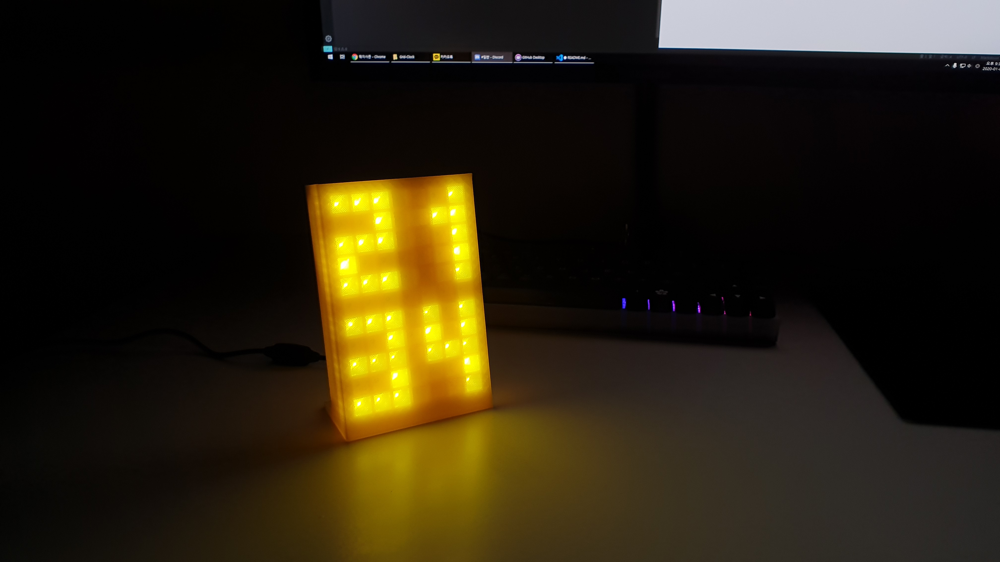

# Grid-Clock
### 아두이노 기반 LED 그리드 시계 (Arduino based LED Grid Clock)

 

 

 

-----------------------------------------------

### 요구사항 (Requirement)
| Name         | Description |
| ------------ | :---------: |
| Arduino Nano |      -      |
| LED          |    60ea     |
| USB-UART     |      -      |
| 3D Printer   |      -      |
| PLA Filament |      -      |
| Screw        |   3mm 4ea   |

-----------------------------------------------